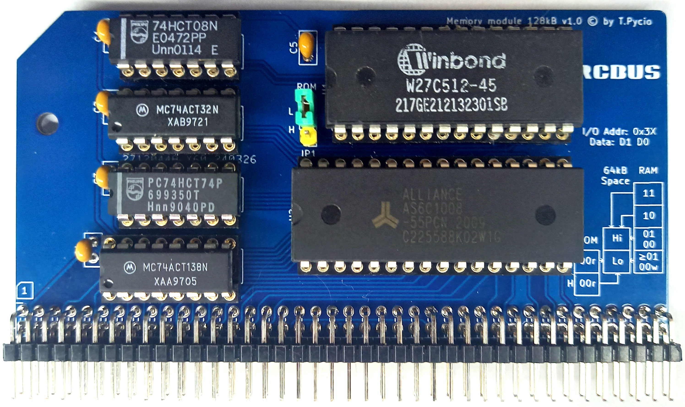

# ROM/RAM 128kB module for RCBus

ROM/RAM 128kB memory module for RCBus systems.
The module allows 32kB of memory banks to be switched to use 128kB of RAM in 64kB of processor address space. After RESET, the lower half of the space is addressed to ROM in read mode and in write mode to the first quadrant of RAM. When the ROM is disconnected, the contents of the RAM so written are not lost. This makes it possible to develop new BIOSes without additional tools. The upper half of the address space can be switched to one of three banks.

## Hardware Documentation

### Schematic

[Schematic - Version 1.0](Schematic.pdf)

## Bill of Materials

| Component type     | Reference | Description                                 | Quantity |
| ------------------ | --------- | ------------------------------------------- | -------- |
| PCB                |           | Memory module 128kB - Version 1.0           | 1        |
| Integrated Circuit | U1        | ROM W27C512, 28 pin DIP                     | 1        |
| Integrated Circuit | U2        | SRAM 128kB 62128, 32 pin DIP                | 1        |
| Integrated Circuit | U3        | 74HCT138 - 3-to-8 line decoder, 16 pin DIP  | 1        |
| Integrated Circuit | U4        | 74HCT74 - Dual D flip-flop, 14 pin DIP      | 1        |
| Integrated Circuit | U5        | 74HCT32 - Quad 2-input OR gate, 14 pin DIP  | 1        |
| Integrated Circuit | U6        | 74HCT08 - Quad 2-input AND gate, 14 pin DIP | 1        |
| Connector          | S1        | 2x40 pin header, 2.54 mm pitch, angle       | 1        |
| Pin Header         | JP1       | 3 pin header, 2.54 mm pitch                 | 1        |
| Capacitor          | C1 - C5   | 0.1 uF, 50V, MLCC, 2.5 mm pitch             | 4        |
| IC Socket          | U1        | 28 pin DIP                                  | 1        |
| IC Socket          | U2        | 32 pin DIP                                  | 1        |
| IC Socket          | U3        | 16 pin DIP                                  | 1        |
| IC Socket          | U4 - U6   | 14 pin DIP                                  | 3        |

Gerber files prepared for production at JLCPCB

## Release Notes

### Changes

* Version 1.0
  
  * Initial version

## License

Copyright 2024 Tadeusz Pycio

This work is licensed under a [Creative Commons Attribution-NonCommercial 4.0 International (CC BY-NC 4.0) ](https://creativecommons.org/licenses/by-nc/4.0/).
